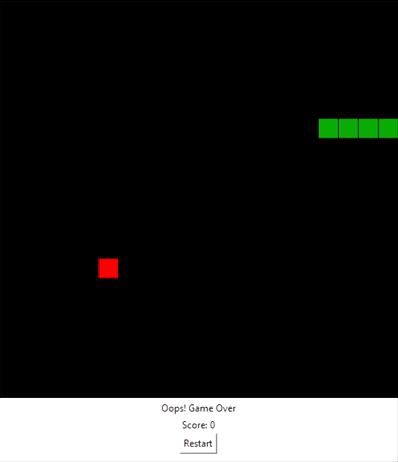

# Snake Game

The snake game using tkinter.

## Requirements

Python `v3.10.5` with the Tkinter GUI library.

### Installing `Tkinter`

If `Tkinter` is not already installed, install it via `pip`. In your CLI type:

    pip install tk

## Running the game

Clone the repository or download the project. Then in the project root directory, run the `main.py` script.

    python main.py

## Controls

`<` Left Arrow Key: Turn left

`>` Right Arrow Key: Turn right

## Playing the game

Eat food and grow longer.

Use the arrow keys to turn.

Don't hit the walls

Don't eat yourself

Have fun
